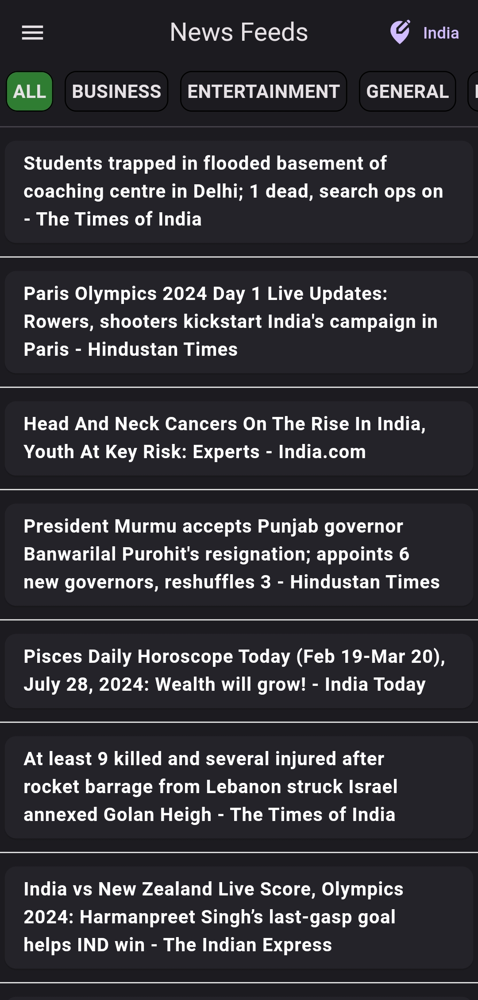
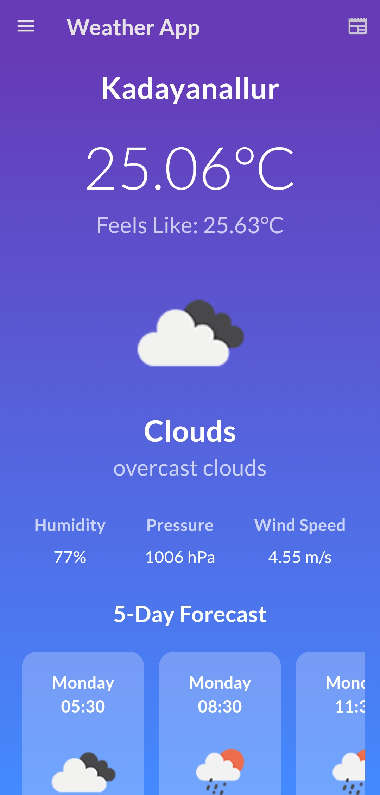
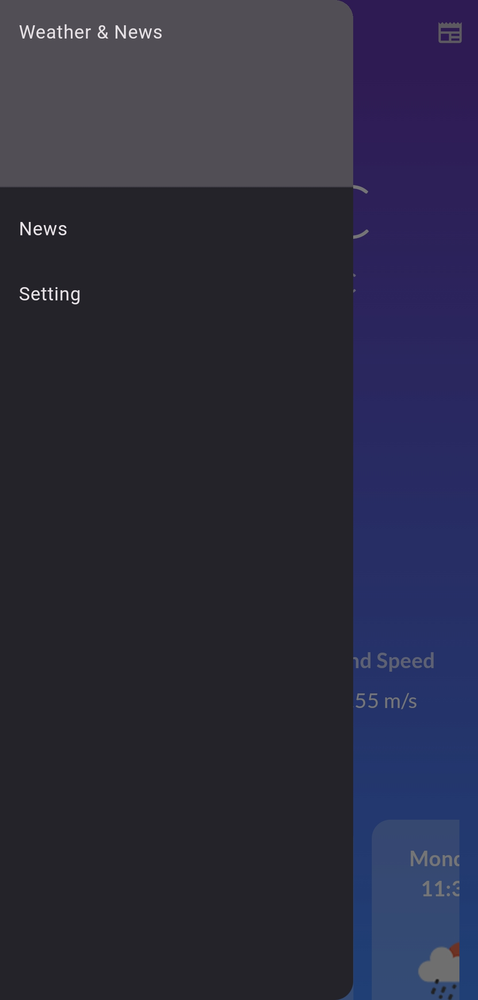
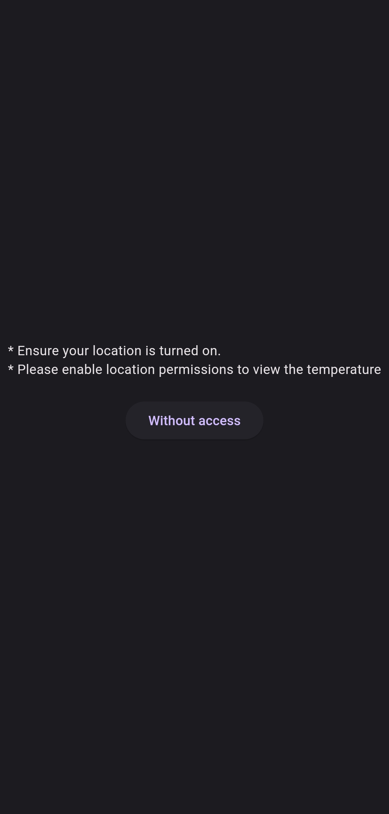
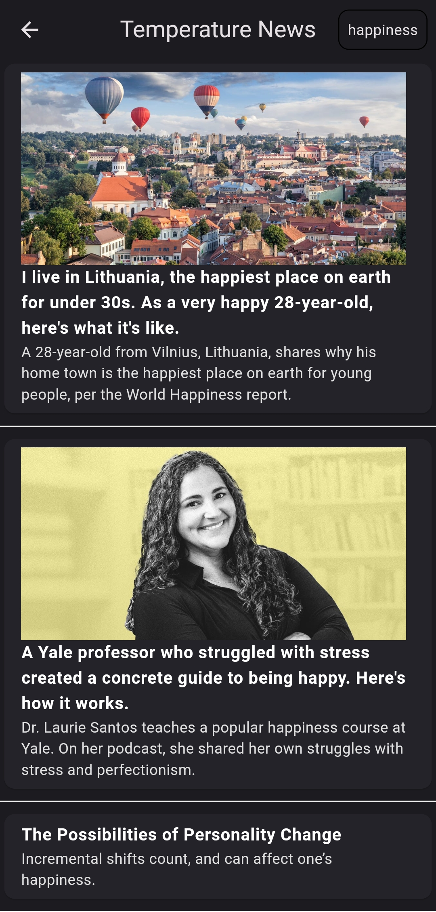
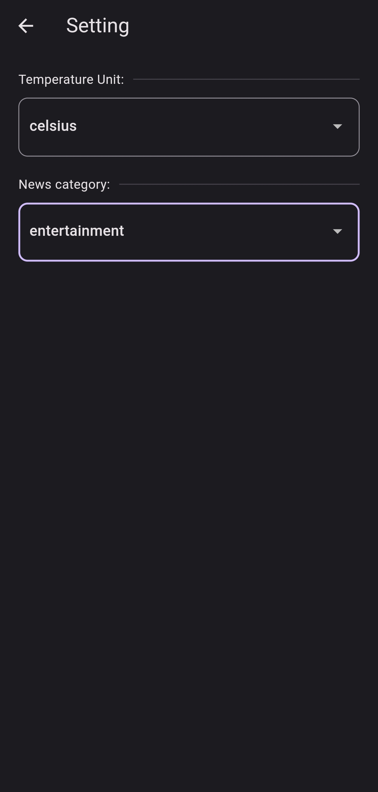

# Weather & News

## News Feeds Screen

### News Headlines:
* Fetch the latest news headlines.
* Display headlines, brief descriptions, and links to full articles.
* Use a publicly available news API (e.g., NewsAPI).

## Weather Screen

### Weather Information:
■ Fetch current weather data based on the user's location.
■ Display temperature, weather conditions, and a five-day forecast.
■ Use a publicly available weather API (e.g., OpenWeatherMap API).

## App Drawer

## Location Permission Unable screen

## Weather-Based News Filtering
* ##### Implement logic to filter news based on the current weather:
	* If the weather is cold, show only depressing news headlines.
	* If the weather is hot, show news articles related to fear.
	* If the weather is cool, show news articles about winning and happiness.

## Setting Screen
### Settings:
* Allow users to select their preferred units for temperature (Celsius/Fahrenheit).
* Enable users to select news categories they are interested in.

## The app has a responsive design to support different screen sizes.

#### Web Max ~ 1200
> Weather

> News 

#### Medium ~ 900
> Weather

> News 

